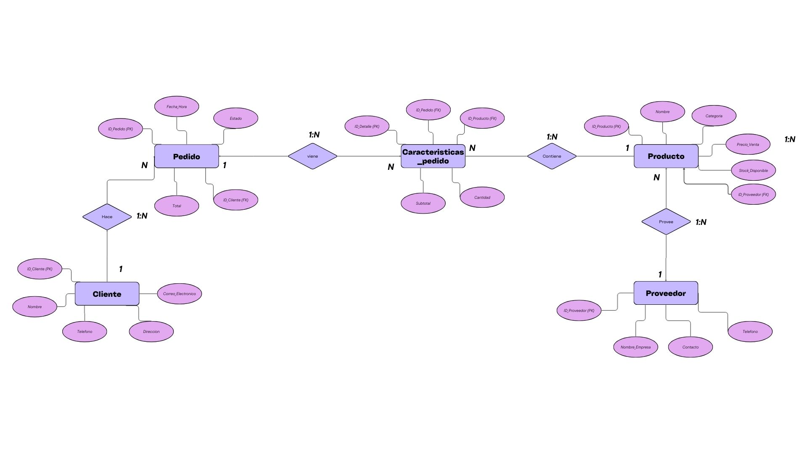
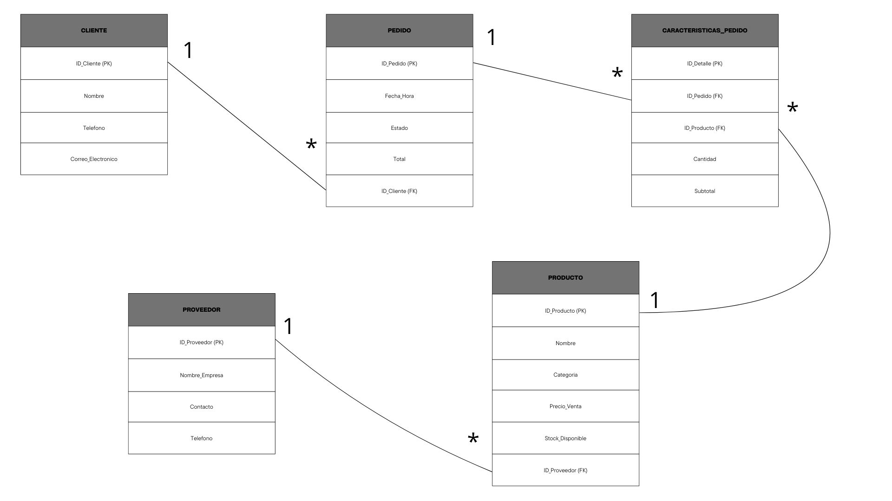

# NANO-FLORERIA
#  Sistema de Gestión de Base de Datos para Florería

##  Descripción General
Este proyecto consiste en el diseño estructurado de una base de datos relacional para gestionar las operaciones fundamentales de una florería. El sistema permite administrar el ciclo completo de ventas e inventario, rastreando desde la información de los clientes y sus pedidos, hasta el control de stock de los productos (flores, arreglos, accesorios) y el registro de los proveedores que los surten. 

##  Motivación
La idea nació de la necesidad real de poner orden en las ventas y el inventario de mi negocio. En lugar de llevar todo en libretas o en hojas de cálculo desordenadas, decidí aplicar mi proyecto de bases de datos para crear una herramienta que me ayude a administrar la tienda de forma profesional. 

Este diseño me permite saber exactamente qué vendo, a quién se lo vendo y qué necesito resurtir, conectando toda la información de forma inteligente para no duplicar datos ni cometer errores en las cuentas.

##  Descripción de los Diagramas

Para el diseño de esta arquitectura, se elaboraron dos diagramas que representan el sistema en diferentes niveles de abstracción:

### 1. Diagrama Entidad-Relación (ER)
Este diagrama representa el **modelo conceptual** del negocio. Muestra visualmente cómo interactúan los actores principales de la florería sin entrar en detalles técnicos de programación. 

* **Entidades Principales:** Se definieron 5 entidades clave: `Cliente`, `Pedido`, `Caracteristicas_pedido`, `Producto` y `Proveedor`.
* **Resolución de Relaciones:** Destaca la creación de la entidad intermedia `Caracteristicas_pedido`, la cual es vital para desglosar la relación de *Muchos a Muchos* (N:M) entre los Pedidos y los Productos, permitiendo registrar la cantidad y el subtotal exacto de cada artículo vendido sin duplicar información.

### 2. Esquema Relacional (UML de Base de Datos)
Este diagrama representa el **modelo lógico**, adaptando la notación UML estrictamente para el diseño de bases de datos (sin métodos ni visibilidad de Programación Orientada a Objetos). Es el plano directo para la codificación.

* **Estructura de Tablas:** Define claramente los campos (columnas) que contendrá cada tabla.
* **Integridad Referencial:** Especifica la ubicación exacta de las **Llaves Primarias (PK)** para identificar registros únicos, y las **Llaves Foráneas (FK)** para vincular las tablas (ej. `ID_Cliente` dentro de `Pedido`, o `ID_Proveedor` dentro de `Producto`).
* **Multiplicidad:** Utiliza notación directa (1 a *) para indicar de qué lado de la relación se ubican los catálogos principales y de qué lado ocurren las transacciones o repeticiones.

  ## 📘 Diccionario de Datos

A continuación se describen las tablas que forman parte de la base de datos, junto con sus campos y su función dentro del sistema.

---

### 🔹 Cliente

| Campo | Tipo | Descripción |
|------|------|------------|
| ID_Cliente | INT (PK) | Identificador único de cada cliente |
| Nombre | VARCHAR(100) | Nombre del cliente |
| Telefono | VARCHAR(20) | Número de teléfono |
| Correo_Electronico | VARCHAR(100) | Correo electrónico |

---

### 🔹 Pedido

| Campo | Tipo | Descripción |
|------|------|------------|
| ID_Pedido | INT (PK) | Identificador único del pedido |
| Fecha_Hora | DATETIME | Fecha y hora en que se realizó |
| Estado | VARCHAR(50) | Estado actual del pedido |
| Total | DECIMAL(10,2) | Total a pagar |
| ID_Cliente | INT (FK) | Cliente que hizo el pedido |

---

### Producto

| Campo | Tipo | Descripción |
|------|------|------------|
| ID_Producto | INT (PK) | Identificador del producto |
| Nombre | VARCHAR(100) | Nombre del producto |
| Categoria | VARCHAR(50) | Tipo o categoría |
| Precio_Venta | DECIMAL(10,2) | Precio por unidad |
| Stock_Disponible | INT | Cantidad disponible |
| ID_Proveedor | INT (FK) | Proveedor del producto |

---

### Proveedor

| Campo | Tipo | Descripción |
|------|------|------------|
| ID_Proveedor | INT (PK) | Identificador del proveedor |
| Nombre_Empresa | VARCHAR(100) | Nombre de la empresa |
| Contacto | VARCHAR(100) | Persona de contacto |
| Telefono | VARCHAR(20) | Teléfono |

---

###  Caracteristicas_Pedido

| Campo | Tipo | Descripción |
|------|------|------------|
| ID_Detalle | INT (PK) | Identificador del detalle |
| ID_Pedido | INT (FK) | Pedido al que pertenece |
| ID_Producto | INT (FK) | Producto incluido |
| Cantidad | INT | Número de unidades |
| Subtotal | DECIMAL(10,2) | Resultado de cantidad por precio |

##  Conclusión
Este diseño establece una base de datos sólida, normalizada y escalable para la administración de mi florería.

By: Paola Perez Cruz
